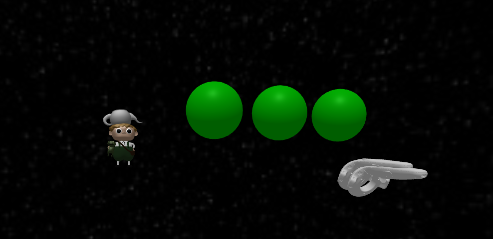

# Vive aframe

Originally based off: https://github.com/bryik/aframe-ball-throw & https://github.com/prairie-vr/gregory-vr

Playable with **HTC Vive**.

This repository contains a small demonstration of A-Frame with vive controllers and physics powered by [A-Frame Extras](https://github.com/donmccurdy/aframe-extras). Grab a ball and chuck it at the stack of boxes!

### Expansion and Experimentation

Try forking this component and messing around with it. For instance, 

Change the force of gravity from 1.6 m/s^2 (similar to the Moon), to 9.8 m/s^2 (similar to the Earth).

```html
    <a-scene physics='gravity: -9.8' antialias='true'>
```

### Local Development

To serve the site from a simple Node development server:

    npm start

Then launch the site from your favourite browser:

[__http://localhost:3000/__](http://localhost:3000/)

If you wish to serve the site from a different port:

    PORT=8000 npm start


## License

This program is free software and is distributed under an [MIT License](LICENSE).

# A-Frame Boilerplate

Boilerplate for creating WebVR scenes using A-Frame.


## Getting Started

There are two easy options for obtaining this A-Frame scene. It's then up to you to make it your own!

### <sup>Option 1:</sup> Download the ZIP kit 📦

[](https://github.com/aframevr/aframe-boilerplate/archive/master.zip)

After you have __[downloaded and extracted this `.zip` file](https://github.com/aframevr/aframe-boilerplate/archive/master.zip)__ containing the contents of this repo, open the resulting directory, and you'll be have your scene ready in these few steps:

    npm install && npm start
    open http://localhost:3000/

<hr>

### <small><sup>Option 2:</sup> Fork this Git repo 🍴🐙

Alternatively, you can __[fork this repo](https://github.com/aframevr/aframe-boilerplate/fork)__ to get started, if you'd like to maintain a Git workflow.

After you have __[forked this repo](https://github.com/aframevr/aframe-boilerplate/fork)__, clone a copy of your fork locally and you'll be have your scene ready in these few steps:

    git clone https://github.com/aframevr/aframe-boilerplate.git
    cd aframe-boilerplate && rm -rf .git && npm install && npm start
    open http://localhost:3000/

> :iphone: **Mobile pro tip:** Upon starting the development server, the URL will be logged to the console. Load that URL from a browser on your mobile device. (If your mobile phone and computer are not on the same LAN, consider using [ngrok](https://ngrok.com/) for local development and testing. [Browsersync](https://www.browsersync.io/) is also worth a gander.)

<hr>

### <small><sup>Option 3:</sup> Fork this CodePen example 🍴💾✒️

Or, you can simply __[fork this CodePen example](http://codepen.io/team/mozvr/pen/BjygdO?editors=100)__ to dive right in. Enjoy!


## Publishing your scene

If you don't already know, GitHub offers free and awesome publishing of static sites through __[https://pages.github.com/](GitHub Pages)__.

To publish your scene to your personal GitHub Pages:

    npm run deploy

And, it'll now be live at __http://`your_username`.github.io/__ :)

<hr>

To know which GitHub repo to deploy to, the `deploy` script first looks at the optional [`repository` key](https://docs.npmjs.com/files/package.json#repository) in the [`package.json` file](package.json) (see [npm docs](https://docs.npmjs.com/files/package.json#repository) for sample usage). If the `repository` key is missing, the script falls back to using the local git repo's remote origin URL (you can run the local command `git remote -v` to see all your remotes; also, you may refer to the [GitHub docs](https://help.github.com/articles/about-remote-repositories/) for more information).

<hr>

